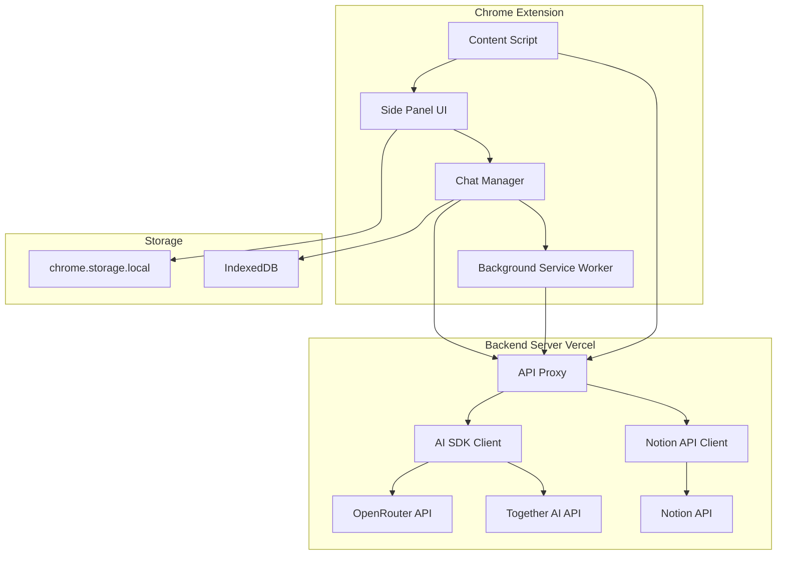
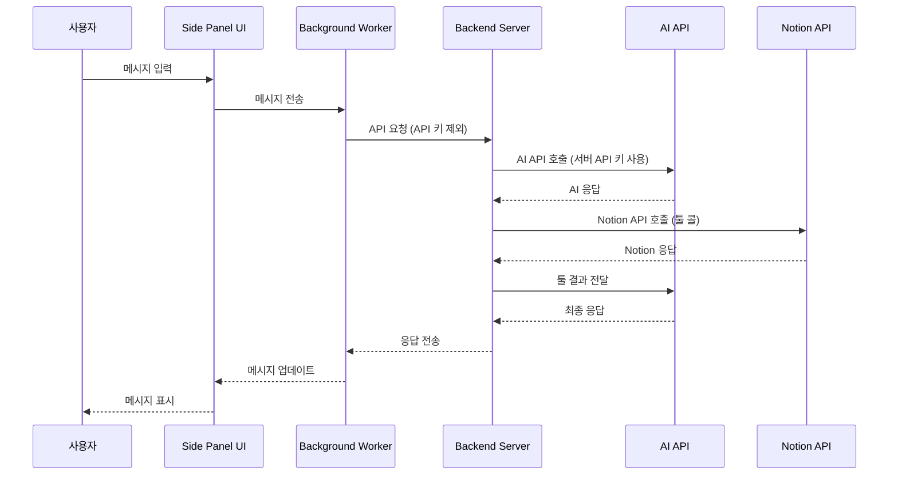

# Chrome 확장 프로그램 환경 호환성 검증

## 📋 개요

**문서 목적**: Annai 프로젝트의 툴 콜링 시스템이 Chrome 확장 프로그램 환경에서 잘 작동하는지 검증
**검증 대상**: Vercel AI SDK, Notion API, Chrome 확장 프로그램 제약사항

---

## ✅ 검증 결과

### 1. Vercel AI SDK Chrome 확장 프로그램 호환성

**결론**: ✅ **호환성 확인됨**

**증거**:
- **실제 사례 1**: [Delight](https://chromewebstore.google.com/detail/ojemjgmjkfaehppekejloiekjlhlcmdf) - Vercel AI SDK를 사용하여 6개 AI 제공자 (OpenAI, Anthropic, Google Gemini, Groq, SambaNova)와 25+ 모델을 지원하는 Chrome 확장 프로그램
- **실제 사례 2**: [Vercel AI SDK Chrome Extension](https://github.com/vercel-labs/ai-sdk-chrome-extension) - Vercel Labs에서 제공하는 공식 Chrome 확장 프로그램 템플릿

**주요 특징**:
- 다중 AI 제공자 통합 가능
- 스트리밍 지원 (기본 제공)
- 툴 콜링 지원
- Chrome Side Panel API와 통합 가능
- React/SolidJS와 호환

---

### 2. Chrome 확장 프로그램 제약사항 분석

#### 2.1 Content Security Policy (CSP)

**상태**: ✅ **문제 없음**

Chrome 확장 프로그램은 다음과 같은 CSP 제약이 있습니다:
- 인라인 스크립트 제한
- `eval()` 제한
- 외부 스크립트 로드 제한

**Vercel AI SDK 호환성**:
- SDK는 모든 코드를 번들링하여 사용하므로 CSP 문제 없음
- 인라인 스크립트를 사용하지 않음
- `eval()`을 사용하지 않음

**결론**: Vercel AI SDK는 Chrome 확장 프로그램의 CSP 제약을 완벽하게 준수합니다.

#### 2.2 CORS (Cross-Origin Resource Sharing)

**상태**: ⚠️ **고려 필요**

Chrome 확장 프로그램에서 외부 API를 호출할 때 CORS 문제가 발생할 수 있습니다.

**해결 방안**:

**옵션 A: 백엔드 서버 사용 (Vercel Labs 접근)**
```typescript
// 확장 프로그램 → 백엔드 서버 → AI API
extension → backend (Vercel) → AI API
```

**장점**:
- API 키를 서버에서 관리하여 보안 강화
- CORS 문제 완전 해결
- 속도 제한, 요청 로깅 등 서버 사이드 처리 가능

**단점**:
- 백엔드 서버 유지 관리 필요
- 추가 비용 발생 (Vercel 호스팅)
- 지연 시간 증가

**옵션 B: 직접 API 호출 (Delight 접근)**
```typescript
// 확장 프로그램 → AI API (직접)
extension → AI API
```

**장점**:
- 아키텍처 단순화
- 추가 비용 없음
- 낮은 지연 시간

**단점**:
- API 키를 클라이언트에 저장 (보안 고려 필요)
- manifest.json에 권한 추가 필요
- CORS 문제 발생 가능성

**CORS 해결 방법**:
```json
// manifest.json
{
  "permissions": [
    "https://api.openai.com/*",
    "https://api.anthropic.com/*",
    "https://api.together.xyz/*",
    "https://openrouter.ai/*"
  ]
}
```

**권한 추가**: Chrome 확장 프로그램에서 특정 도메인에 대한 요청을 허용하려면 `host_permissions` 또는 `permissions`에 추가해야 합니다.

**권장 접근**: **옵션 A (백엔드 서버)**
- 보안 강화
- API 키 관리 용이
- CORS 문제 완전 해결
- 향후 확장성 고려

#### 2.3 Storage 제약

**상태**: ✅ **문제 없음**

Chrome 확장 프로그램은 다음과 같은 스토리지 제약이 있습니다:
- `chrome.storage.local`: 최대 5MB
- `chrome.storage.sync`: 최대 100KB

**해결 방안**:
```typescript
// API 키 및 설정 저장
await chrome.storage.local.set({
  settings: {
    ai: { provider: 'openrouter', model: 'gpt-4o', apiKey: '...' },
    notion: { apiKey: '...' }
  }
});

// 채팅 히스토리 저장 (IndexedDB 사용)
const db = await openDB('annai-db', 1, {
  upgrade(db) {
    db.createObjectStore('messages');
  }
});
```

**결론**: API 키와 설정은 `chrome.storage.local`에, 채팅 히스토리는 IndexedDB에 저장하여 제약을 해결합니다.

#### 2.4 Service Worker (Background Script)

**상태**: ✅ **문제 없음**

Chrome 확장 프로그램 MV3는 Service Worker를 사용합니다.

**Vercel AI SDK 호환성**:
- SDK는 Service Worker 환경에서 작동 가능
- `fetch` API 사용 가능
- 비동기 작업 지원

**주의사항**:
```typescript
// background.ts (Service Worker)
import { generateText } from 'ai';
import { openrouter } from '@openrouter/ai-sdk-provider';

// Service Worker에서 작동 가능
const result = await generateText({
  model: openrouter.chat('anthropic/claude-3.5-sonnet'),
  messages: [...]
});
```

**결론**: Vercel AI SDK는 Service Worker 환경에서 완벽하게 작동합니다.

#### 2.5 Content Script 제약

**상태**: ✅ **문제 없음**

Content Script는 웹페이지의 DOM에 접근할 수 있습니다.

**Notion 페이지 컨텍스트 추출**:
```typescript
// content/index.tsx
function extractNotionContext() {
  return {
    title: document.title,
    url: window.location.href,
    content: document.body.innerText,
    // Notion 특정 요소 추출
    blocks: Array.from(document.querySelectorAll('[data-block-id]'))
      .map(el => el.innerText)
  };
}
```

**결론**: Content Script에서 Notion 페이지 컨텍스트를 추출하여 AI에 전달할 수 있습니다.

---

### 3. Notion API Chrome 확장 프로그램 호환성

**결론**: ✅ **호환성 확인됨**

**Notion SDK** (`@notionhq/client`)는 다음과 같은 특징이 있습니다:
- Node.js 및 브라우저 환경 모두 지원
- `fetch` API 기반으로 작동
- Chrome 확장 프로그램에서 사용 가능

**주의사항**:
```typescript
// Notion API는 CORS를 지원하지 않음
// 따라서 백엔드 서버를 통하거나
// Chrome 확장 프로그램 권한을 추가해야 함

// manifest.json
{
  "permissions": [
    "https://api.notion.com/*"
  ]
}
```

**권장 접근**: 백엔드 서버를 통한 Notion API 호출
- Notion API 토큰을 서버에서 관리
- CORS 문제 해결
- 보안 강화

---

## 🏗️ 권장 아키텍처

### 전체 구성도



### 데이터 흐름



---

## 🔧 구현 방안

### 방안 1: 백엔드 서버 사용 (권장)

**아키텍처**:
```
Chrome Extension → Backend Server (Vercel) → AI/Notion APIs
```

**장점**:
- ✅ 보안 강화 (API 키 서버 관리)
- ✅ CORS 문제 완전 해결
- ✅ 속도 제한, 요청 로깅 등 서버 사이드 처리
- ✅ 향후 확장성 고려
- ✅ 사용자 경험 향상 (API 키 입력 필요 없음)

**단점**:
- ⚠️ 백엔드 서버 유지 관리 필요
- ⚠️ 추가 비용 발생 (Vercel 호스팅)
- ⚠️ 지연 시간 증가

**비용**:
- Vercel Hobby Plan: 무료 (월 100GB 대역폭, 6,000분 실행 시간)
- Vercel Pro Plan: $20/월 (무제한 대역폭, 100,000분 실행 시간)

**구현 예정**:
```typescript
// backend/api/chat/route.ts
import { generateText } from 'ai';
import { openrouter } from '@openrouter/ai-sdk-provider';
import { Client } from '@notionhq/client';

export async function POST(req: Request) {
  const { messages, settings } = await req.json();

  // AI 응답 생성
  const result = await generateText({
    model: openrouter.chat(settings.model),
    messages,
    tools: notionTools,
  });

  return Response.json(result);
}
```

### 방안 2: 직접 API 호출

**아키텍처**:
```
Chrome Extension → AI/Notion APIs (직접)
```

**장점**:
- ✅ 아키텍처 단순화
- ✅ 추가 비용 없음
- ✅ 낮은 지연 시간

**단점**:
- ⚠️ API 키를 클라이언트에 저장 (보안 고려 필요)
- ⚠️ manifest.json에 권한 추가 필요
- ⚠️ CORS 문제 발생 가능성

**구현 예정**:
```typescript
// manifest.json
{
  "permissions": [
    "https://api.openai.com/*",
    "https://api.anthropic.com/*",
    "https://api.together.xyz/*",
    "https://openrouter.ai/*",
    "https://api.notion.com/*",
    "storage"
  ]
}

// lib/ai/client.ts
import { generateText } from 'ai';
import { openrouter } from '@openrouter/ai-sdk-provider';

export async function chat(messages: Message[], settings: AISettings) {
  const result = await generateText({
    model: openrouter.chat(settings.model, {
      apiKey: settings.apiKey // 사용자 API 키
    }),
    messages,
    tools: notionTools,
  });

  return result;
}
```

---

## 📊 비교 분석

| 항목 | 방안 1 (백엔드) | 방안 2 (직접) |
|--------|---------------------|-----------------|
| 보안 | ⭐⭐⭐⭐⭐ | ⭐⭐⭐ |
| 복잡도 | ⭐⭐⭐ | ⭐ |
| 비용 | ⭐⭐ | ⭐⭐⭐⭐⭐ |
| 지연 시간 | ⭐⭐⭐ | ⭐⭐⭐⭐⭐ |
| 유지 관리 | ⭐⭐ | ⭐⭐⭐⭐⭐ |
| 확장성 | ⭐⭐⭐⭐⭐ | ⭐⭐⭐ |
| CORS 문제 | ✅ 해결 | ⚠️ 권한 필요 |

---

## 🎯 권장 사항

### MVP 단계 (프로토타입)

**권장**: **방안 2 (직접 API 호출)**

**이유**:
- 빠른 개발 가능
- 추가 비용 없음
- 프로토타입 단계에서는 보안 우선순위 낮음
- 사용자 피드백 빠르게 수집 가능

**구현 우선순위**:
1. ✅ Vercel AI SDK 설치 및 설정
2. ✅ OpenRouter/Together AI 제공자 구현
3. ✅ Notion API 클라이언트 구현
4. ✅ 툴 정의 및 구현
5. ✅ 채팅 매니저 구현
6. ✅ Chrome 확장 프로그램 권한 추가
7. ✅ UI 통합

### v1.0 릴리스 단계

**권장**: **방안 1 (백엔드 서버)**

**이유**:
- 보안 강화 필요
- CORS 문제 완전 해결
- 상용화 준비
- 사용자 경험 향상

**마이그레이션 계획**:
1. ✅ 백엔드 서버 구축 (Vercel)
2. ✅ API 프록시 구현
3. ✅ API 키 서버 사이드로 이동
4. ✅ 확장 프로그램에서 백엔드 호출로 변경
5. ✅ 테스트 및 검증

---

## 🔐 보안 고려사항

### 방안 1 (백엔드 서버)

**보안**:
- API 키를 환경 변수로 저장 (Vercel)
- HTTPS 필수 사용
- 요청 속도 제한 구현
- API 키 순환 및 만료 처리

### 방안 2 (직접 API 호출)

**보안**:
- API 키를 `chrome.storage.local`에 암호화하여 저장
- manifest.json에 최소 권한만 추가
- API 키 노출 방지 (로깅 제외)
- 사용자 동의 얻기

---

## 📝 결론

### Chrome 확장 프로그램 호환성

**Vercel AI SDK**: ✅ **완벽하게 호환**
- 실제 사례 다수 존재
- Chrome 확장 프로그램 제약사항 모두 준수
- Service Worker 환경에서 작동 가능

**Notion API**: ✅ **호환 (권한 추가 필요)**
- 브라우저 환경 지원
- CORS 문제 해결 필요

### 권장 접근

**MVP**: 방안 2 (직접 API 호출)
- 빠른 개발
- 비용 절감
- 프로토타입 단계 적합

**v1.0**: 방안 1 (백엔드 서버)
- 보안 강화
- CORS 완전 해결
- 상용화 준비

### 다음 단계

1. MVP 개발 시작 (방안 2)
2. 사용자 피드백 수집
3. v1.0 마이그레이션 (방안 1)
4. 웹 스토어 제출

---

*문서 생성일: 2026-01-18*
*마지막 수정일: 2026-01-18*
