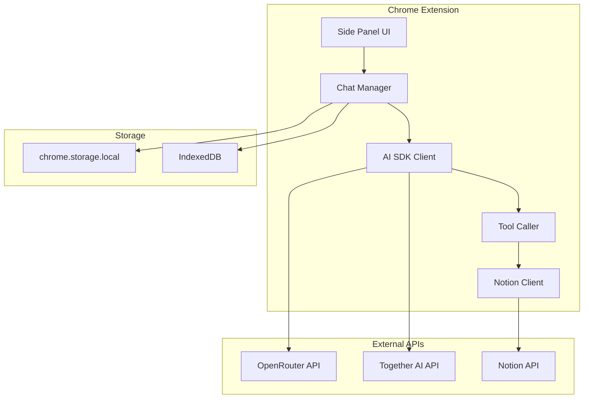
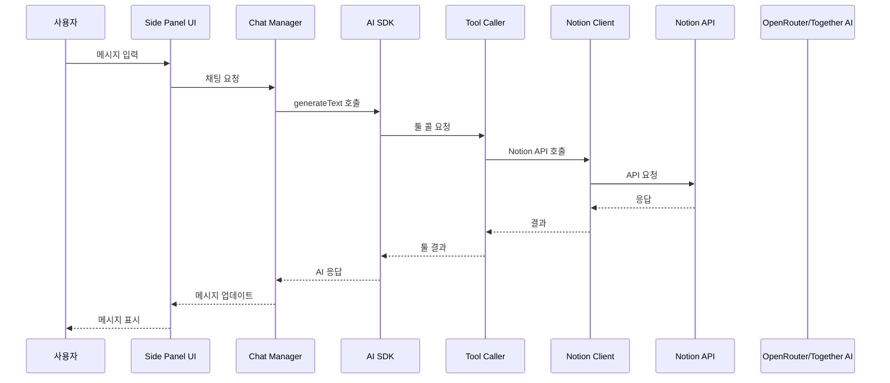

# MVP 구현 계획

## 📋 개요

**목표**: Chrome 확장 프로그램에서 직접 API 호출 방식을 사용하여 Annai MVP 개발
**기간**: 1주일 (7일)
**접근 방식**: host_permissions를 통한 직접 API 호출

---

## 🎯 MVP 범위

### 포함 기능
1. ✅ AI 모델 선택 (OpenRouter, Together AI)
2. ✅ API 키 입력 및 저장
3. ✅ Notion API 통합 (페이지/블록 CRUD)
4. ✅ 툴 콜링 시스템
5. ✅ 채팅 인터페이스
6. ✅ 메시지 히스토리 저장

### 제외 기능 (v1.0 이후)
- ❌ 백엔드 서버
- ❌ 검색 및 쿼리 기능
- ❌ 고급 편집 기능
- ❌ 템플릿 시스템

---

## 🏗️ 아키텍처

### 전체 구성도



### 데이터 흐름



---

## 🔧 기술 스택

### 핵심 라이브러리

| 라이브러리 | 버전 | 용도 |
|-----------|------|------|
| `ai` | 최신 | 툴 콜링 프레임워크 |
| `@openrouter/ai-sdk-provider` | 최신 | OpenRouter 통합 |
| `@ai-sdk/openai-compatible` | 최신 | Together AI 통합 |
| `@notionhq/client` | 최신 | Notion API 클라이언트 |
| `zod` | 최신 | 스키마 검증 |
| `solid-js` | 1.9.10 | UI 프레임워크 |
| `dexie` | 최신 | IndexedDB 래퍼 |

---

## 📦 파일 구조

```
Annai/
├── lib/
│   ├── ai/
│   │   ├── providers/
│   │   │   ├── openrouter.ts      # OpenRouter 제공자
│   │   │   ├── together.ts         # Together AI 제공자
│   │   │   └── manager.ts         # 제공자 매니저
│   │   └── client.ts              # AI 클라이언트
│   ├── notion/
│   │   └── client.ts              # Notion API 클라이언트
│   ├── tools/
│   │   └── notion-tools.ts       # Notion 툴 정의
│   ├── prompts/
│   │   └── system-prompt.ts      # 시스템 프롬프트
│   ├── store/
│   │   ├── settings.ts           # 설정 스토어
│   │   └── chat-history.ts      # 채팅 히스토리
│   └── db/
│       └── index.ts              # IndexedDB 설정
├── components/
│   ├── Chat/
│   │   ├── MessageList.tsx        # 메시지 리스트
│   │   ├── ToolCallDisplay.tsx    # 툴 콜 표시
│   │   └── LoadingIndicator.tsx   # 로딩 표시
│   └── Settings/
│       ├── SettingsPanel.tsx      # 설정 패넬
│       ├── AIModelSelector.tsx    # AI 모델 선택
│       └── NotionAuth.tsx        # Notion 인증
└── entrypoints/
    ├── popup/
    │   └── Settings.tsx           # 팝업 설정 페이지
    └── content/
        └── index.tsx             # 콘텐츠 스크립트
```

---

## 📅 일정

### Day 1: 기본 설정 (1/19)

**목표**: 프로젝트 설정 및 AI 제공자 구현

**작업**:
- [ ] Vercel AI SDK 설치
  ```bash
  bun add ai @openrouter/ai-sdk-provider @ai-sdk/openai-compatible zod @notionhq/client dexie
  ```
- [ ] OpenRouter 제공자 구현
  - 파일: `lib/ai/providers/openrouter.ts`
  - 기능: OpenRouter 클라이언트 생성, 모델 리스트
- [ ] Together AI 제공자 구현
  - 파일: `lib/ai/providers/together.ts`
  - 기능: Together AI 클라이언트 생성, 모델 리스트
- [ ] 제공자 매니저 구현
  - 파일: `lib/ai/providers/manager.ts`
  - 기능: 제공자 선택, 모델 가져오기

**완료 기준**:
- ✅ `bun run dev`로 확장 프로그램 로드 가능
- ✅ OpenRouter 및 Together AI 제공자 초기화 성공

### Day 2: Notion API 통합 (1/20)

**목표**: Notion API 클라이언트 및 툴 구현

**작업**:
- [ ] Notion 클라이언트 구현
  - 파일: `lib/notion/client.ts`
  - 기능: 페이지 CRUD, 블록 CRUD
- [ ] Notion 툴 정의
  - 파일: `lib/tools/notion-tools.ts`
  - 툴: createPage, getPage, updatePage, deletePage, appendBlock, updateBlock, deleteBlock
- [ ] 시스템 프롬프트 작성
  - 파일: `lib/prompts/system-prompt.ts`
  - 내용: 최소화된 시스템 프롬프트

**완료 기준**:
- ✅ Notion API 연동 성공
- ✅ 모든 툴 정의 완료
- ✅ 툴 실행 테스트 통과

### Day 3: 채팅 시스템 (1/21)

**목표**: 채팅 매니저 및 AI SDK 통합

**작업**:
- [ ] AI 클라이언트 구현
  - 파일: `lib/ai/client.ts`
  - 기능: generateText, streamText, 툴 콜링
- [ ] 채팅 매니저 구현
  - 파일: `lib/chat/manager.ts`
  - 기능: 메시지 관리, AI 호출, 툴 콜 처리
- [ ] IndexedDB 설정
  - 파일: `lib/db/index.ts`
  - 기능: 메시지 저장, 조회

**완료 기준**:
- ✅ AI API 호출 성공
- ✅ 툴 콜링 작동
- ✅ 메시지 저장 가능

### Day 4: 스토리지 (1/22)

**목표**: 설정 및 채팅 히스토리 스토리지

**작업**:
- [ ] 설정 스토어 구현
  - 파일: `lib/store/settings.ts`
  - 기능: API 키 저장, 모델 설정, 불러오기
- [ ] 채팅 히스토리 스토어 구현
  - 파일: `lib/store/chat-history.ts`
  - 기능: 메시지 저장, 조회, 삭제

**완료 기준**:
- ✅ API 키 저장 및 불러오기 가능
- ✅ 채팅 히스토리 저장 가능
- ✅ 설정 유지

### Day 5: UI 구현 (1/23)

**목표**: 채팅 UI 및 설정 UI 구현

**작업**:
- [ ] 메시지 리스트 컴포넌트
  - 파일: `components/Chat/MessageList.tsx`
  - 기능: 메시지 표시, 스크롤
- [ ] 툴 콜 표시 컴포넌트
  - 파일: `components/Chat/ToolCallDisplay.tsx`
  - 기능: 툴 콜 결과 표시
- [ ] 로딩 표시 컴포넌트
  - 파일: `components/Chat/LoadingIndicator.tsx`
  - 기능: 로딩 상태 표시

**완료 기준**:
- ✅ 메시지 표시 가능
- ✅ 툴 콜 결과 표시 가능
- ✅ 로딩 상태 표시 가능

### Day 6: 설정 UI (1/24)

**목표**: 설정 패넬 및 인증 UI 구현

**작업**:
- [ ] 설정 패널 컴포넌트
  - 파일: `components/Settings/SettingsPanel.tsx`
  - 기능: 전체 설정 UI
- [ ] AI 모델 선택 컴포넌트
  - 파일: `components/Settings/AIModelSelector.tsx`
  - 기능: 제공자 및 모델 선택
- [ ] Notion 인증 컴포넌트
  - 파일: `components/Settings/NotionAuth.tsx`
  - 기능: API 키 입력, 테스트

**완료 기준**:
- ✅ 설정 변경 가능
- ✅ AI 모델 선택 가능
- ✅ Notion API 키 입력 및 테스트 가능

### Day 7: 통합 및 테스트 (1/25)

**목표**: 전체 통합 및 테스트

**작업**:
- [ ] FloatingWidget에 채팅 시스템 통합
  - 파일: `components/FloatingWidget.tsx`
  - 기능: 기존 위젯에 채팅 기능 추가
- [ ] 팝업 설정 페이지 구현
  - 파일: `entrypoints/popup/Settings.tsx`
  - 기능: 설정 패넬
- [ ] manifest.json 설정
  - 파일: `wxt.config.ts`
  - 기능: host_permissions 추가
- [ ] 전체 테스트
  - 기능 테스트, 에러 처리, UX 확인

**완료 기준**:
- ✅ 모든 기능 작동
- ✅ 에러 없음
- ✅ 사용자 경험 만족

---

## 🔐 보안 설정

### manifest.json 설정

```typescript
// wxt.config.ts
export default defineConfig({
  manifest: {
    name: 'Annai',
    version: '0.1.0',
    permissions: ['storage'],
    host_permissions: [
      'https://api.openai.com/*',
      'https://api.anthropic.com/*',
      'https://api.together.xyz/*',
      'https://openrouter.ai/*',
      'https://api.notion.com/*',
    ],
  },
});
```

### API 키 관리

```typescript
// lib/store/settings.ts
import { browser } from 'wxt/browser';

export async function saveSettings(settings: Settings) {
  // API 키를 암호화하여 저장 (선택적)
  await browser.storage.local.set({
    settings: {
      ...settings,
      ai: {
        ...settings.ai,
        apiKey: encrypt(settings.ai.apiKey), // 선택적 암호화
      },
      notion: {
        ...settings.notion,
        apiKey: encrypt(settings.notion.apiKey), // 선택적 암호화
      },
    },
  });
}
```

---

## 🧪 테스트 계획

### 유닛 테스트

- [ ] Notion 클라이언트 테스트
- [ ] AI 클라이언트 테스트
- [ ] 툴 실행 테스트
- [ ] 스토리지 테스트

### 통합 테스트

- [ ] 전체 채팅 흐름 테스트
- [ ] 에러 처리 테스트
- [ ] 설정 변경 테스트
- [ ] 크로스 브라우저 테스트

### E2E 테스트

- [ ] 사용자 시나리오 테스트
  - API 키 입력
  - AI 모델 선택
  - 채팅 시작
  - Notion 페이지 생성
  - 블록 추가
  - 메시지 히스토리 확인

---

## 📊 성공 지표

### 기술적 지표
- [ ] API 응답 시간 < 3초
- [ ] 오류율 < 5%
- [ ] 크로스 브라우저 호환성 100%

### 사용자 지표
- [ ] API 키 입력 성공률 100%
- [ ] 채팅 시작 성공률 > 95%
- [ ] 툴 콜 성공률 > 90%

---

## 🚀 배포 계획

### 로컬 테스트
```bash
# 개발 모드
bun run dev

# 빌드
bun run build

# 패키징
bun run zip
```

### 웹 스토어 제출
1. Chrome Web Store 개발자 계정 생성
2. 확장 프로그램 패키지 업로드
3. 스토어 정보 작성
4. 스크린샷 업로드
5. 제출 및 검토 대기

---

## 📝 다음 단계 (v1.0 이후)

### 백엔드 서버 마이그레이션
- Vercel Functions 구축
- API 프록시 구현
- API 키 서버 사이드로 이동

### 추가 기능
- 검색 및 쿼리 기능
- 고급 편집 기능
- 템플릿 시스템
- 멀티턴 대화 최적화

---

*문서 생성일: 2026-01-18*
*마지막 수정일: 2026-01-18*
