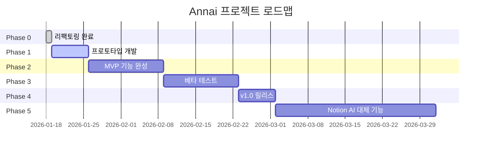
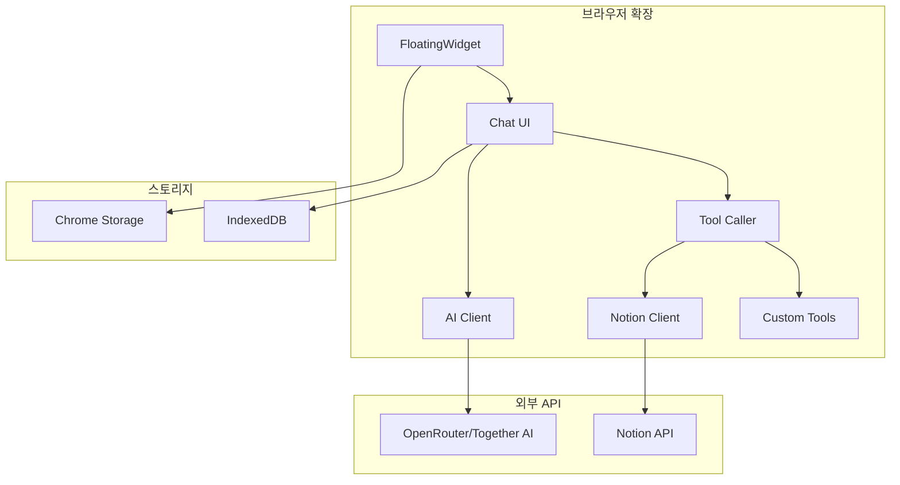
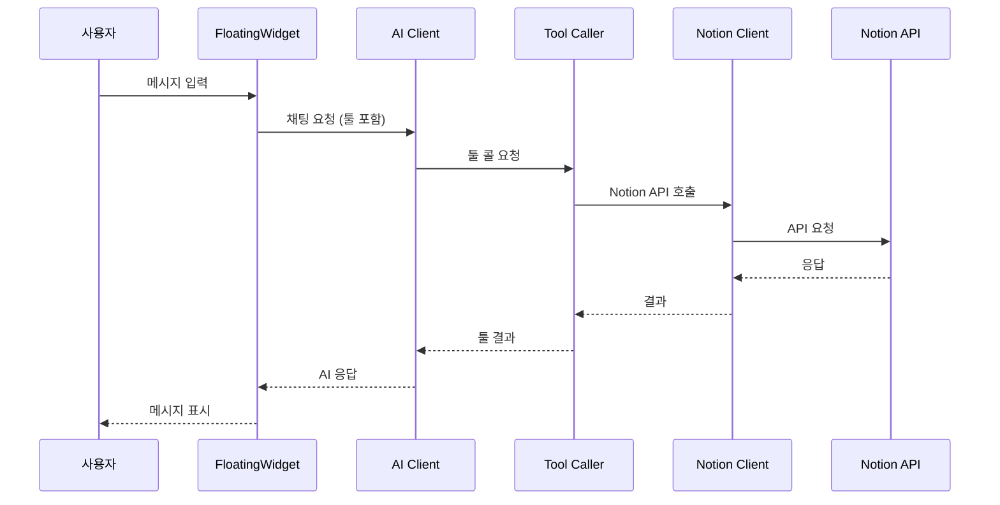

# Annai 프로젝트 로드맵 및 기능 계획

## 📋 개요

**프로젝트명**: Annai (Alt Native Notion AI)
**비전**: Notion 워크스페이스에서 AI 어시스턴트로 생산성 향상
**장기 목표**: Notion AI의 완전한 대체품 (다양한 작업에 적용 가능한 일반화된 AI 어시스턴트)

---

## 🎯 핵심 가치 제안

- **문서 작성 자동화**: AI가 문서를 자동으로 생성하고 편집
- **요약 및 분석**: 긴 문서를 빠르게 요약하고 핵심 내용 추출
- **편집 향상**: 문법 교정, 스타일 변경, 톤 앤 매너 조정
- **워크스페이스 데이터 활용**: 컨텍스트 인식 대화로 워크스페이스 전체 데이터 이해 및 활용

---

## 🚀 전략적 접근

### MVP 전략
- **시스템 프롬프트 레이어**: 최소화 (Thin Layer)
- **핵심 집중**: API 툴 콜링 (Tool Calling)
- **기능 범위**: 기본 CRUD (페이지 생성/읽기/수정/삭제, 블록 추가/수정)
- **개발 방식**: 프로토타입 우선 (1주일 빠른 구현 → 피드백 반영)

### AI 모델 전략
- **플랫폼**: OpenRouter/Together AI 등 다중 지원
- **사용자 선택**: 사용자가 원하는 AI 모델 선택 가능
- **유연성**: 새로운 모델 쉽게 추가 가능

---

## 📅 로드맵 단계



---

## 🔧 Phase 0: 리팩토링 완료 ✅

**상태**: 완료
**기간**: 2026-01-18

### 완료된 작업
1. ✅ 보안 취약점 수정 (글로벌 키다운 리스너 제거)
2. ✅ 메모리 누수 수정 (타임아웃 ID 관리)
3. ✅ 아키텍처 개선 (Shadow DOM 적용)
4. ✅ 코드 중복 제거 (공통 setup 모듈)
5. ✅ 하드코딩 제거 (위젯 설정 분리)
6. ✅ 디버그 로그 중앙화
7. ✅ IME 처리 개선 (한국어/중국어/일본어)
8. ✅ 중복 코드 제거
9. ✅ 문서화 업데이트

---

## 🚀 Phase 1: 프로토타입 개발 (1주일)

**상태**: 계획 중
**기간**: 2026-01-19 ~ 2026-01-25
**목표**: 기본 기능만 빠르게 구현하여 사용자 피드백 수집

### 1.1 핵심 기능

#### 1.1.1 설정 및 인증
- [ ] 설정 UI 구현 (팝업)
- [ ] AI 모델 선택 기능 (OpenRouter/Together AI)
- [ ] API 키 입력 및 저장 (브라우저 스토리지)
- [ ] Notion API 토큰 입력 및 저장
- [ ] 기본 설정 (위젯 위치, 테마 등)

#### 1.1.2 Notion API 통합
- [ ] Notion API 클라이언트 구현
- [ ] 페이지 CRUD 기능
  - [ ] 페이지 생성
  - [ ] 페이지 읽기
  - [ ] 페이지 수정
  - [ ] 페이지 삭제
- [ ] 블록 CRUD 기능
  - [ ] 블록 추가
  - [ ] 블록 수정
  - [ ] 블록 삭제

#### 1.1.3 AI 툴 콜링
- [ ] OpenRouter API 클라이언트 구현
- [ ] Together AI API 클라이언트 구현
- [ ] 툴 콜링 시스템 구현
- [ ] Notion API 툴 정의
- [ ] 시스템 프롬프트 (최소화)

#### 1.1.4 채팅 인터페이스 개선
- [ ] 메시지 히스토리 저장
- [ ] 로딩 상태 표시
- [ ] 에러 처리 및 표시
- [ ] 툴 콜 결과 표시

### 1.2 기술 스택

#### API 클라이언트
```typescript
// lib/notion-api.ts
interface NotionClient {
  createPage(params: CreatePageParams): Promise<Page>;
  getPage(pageId: string): Promise<Page>;
  updatePage(pageId: string, params: UpdatePageParams): Promise<Page>;
  deletePage(pageId: string): Promise<void>;
  appendBlock(pageId: string, block: Block): Promise<Block>;
  updateBlock(blockId: string, block: Block): Promise<Block>;
  deleteBlock(blockId: string): Promise<void>;
}
```

```typescript
// lib/ai-client.ts
interface AIClient {
  chat(messages: Message[], tools: Tool[]): Promise<ChatResponse>;
  streamChat(messages: Message[], tools: Tool[]): AsyncIterable<ChatChunk>;
}

interface Tool {
  name: string;
  description: string;
  parameters: object;
  execute: (params: any) => Promise<any>;
}
```

#### 툴 정의
```typescript
// lib/notion-tools.ts
export const NOTION_TOOLS: Tool[] = [
  {
    name: 'create_page',
    description: 'Create a new Notion page',
    parameters: {
      type: 'object',
      properties: {
        parent_id: { type: 'string' },
        title: { type: 'string' },
        content: { type: 'string' }
      }
    },
    execute: createPage
  },
  {
    name: 'get_page',
    description: 'Get a Notion page by ID',
    parameters: {
      type: 'object',
      properties: {
        page_id: { type: 'string' }
      }
    },
    execute: getPage
  },
  {
    name: 'update_page',
    description: 'Update a Notion page',
    parameters: {
      type: 'object',
      properties: {
        page_id: { type: 'string' },
        title: { type: 'string' },
        content: { type: 'string' }
      }
    },
    execute: updatePage
  },
  {
    name: 'delete_page',
    description: 'Delete a Notion page',
    parameters: {
      type: 'object',
      properties: {
        page_id: { type: 'string' }
      }
    },
    execute: deletePage
  },
  {
    name: 'append_block',
    description: 'Append a block to a Notion page',
    parameters: {
      type: 'object',
      properties: {
        page_id: { type: 'string' },
        block_type: { type: 'string' },
        content: { type: 'string' }
      }
    },
    execute: appendBlock
  }
];
```

### 1.3 파일 구조

```
Annai/
├── lib/
│   ├── api/
│   │   ├── notion-client.ts      # Notion API 클라이언트
│   │   ├── ai-client.ts          # AI API 클라이언트
│   │   └── tool-caller.ts        # 툴 콜링 시스템
│   ├── tools/
│   │   └── notion-tools.ts       # Notion 툴 정의
│   ├── store/
│   │   ├── settings.ts           # 설정 스토어
│   │   └── chat-history.ts      # 채팅 히스토리
│   └── prompts/
│       └── system-prompt.ts      # 시스템 프롬프트 (최소화)
├── components/
│   ├── Settings/
│   │   ├── SettingsPanel.tsx    # 설정 패널
│   │   ├── AIModelSelector.tsx  # AI 모델 선택
│   │   └── NotionAuth.tsx       # Notion 인증
│   └── Chat/
│       ├── MessageList.tsx       # 메시지 리스트
│       ├── ToolCallDisplay.tsx   # 툴 콜 표시
│       └── LoadingIndicator.tsx  # 로딩 표시
└── entrypoints/
    ├── popup/
    │   └── Settings.tsx          # 팝업 설정 페이지
    └── content/
        └── index.tsx             # 콘텐츠 스크립트 (기존 유지)
```

### 1.4 시스템 프롬프트 (최소화)

```typescript
// lib/prompts/system-prompt.ts
export const SYSTEM_PROMPT = `
You are Annai, an AI assistant for Notion workspace.

You can help users with:
- Creating, reading, updating, and deleting Notion pages
- Adding, modifying, and deleting blocks in pages

Use the available tools to interact with Notion. Always explain what you're doing before taking action.

Keep responses concise and helpful.
`;
```

---

## 🎯 Phase 2: MVP 기능 완성 (2주)

**기간**: 2026-01-26 ~ 2026-02-08
**목표**: 프로토타입 피드백을 반영하여 MVP 기능 완성

### 2.1 피드백 반영
- [ ] 사용자 피드백 수집 및 분석
- [ ] 버그 수정
- [ ] UX 개선
- [ ] 성능 최적화

### 2.2 추가 기능

#### 2.2.1 검색 및 쿼리
- [ ] 페이지 검색 기능
- [ ] 데이터베이스 쿼리 기능
- [ ] 필터링 기능

#### 2.2.2 고급 편집
- [ ] 블록 타입 다양화 (헤딩, 리스트, 코드 등)
- [ ] 페이지 속성 편집
- [ ] 이미지/파일 첨부

#### 2.2.3 채팅 개선
- [ ] 대화 컨텍스트 관리
- [ ] 멀티턴 대화 지원
- [ ] 대화 내용 내보내기
- [ ] 대화 히스토리 검색

### 2.3 테스트 및 QA
- [ ] 유닛 테스트 작성
- [ ] 통합 테스트 작성
- [ ] E2E 테스트 작성
- [ ] 크로스 브라우저 테스트

---

## 🧪 Phase 3: 베타 테스트 (2주)

**기간**: 2026-02-09 ~ 2026-02-22
**목표**: 소수 사용자에게 베타 버전 배포 및 피드백 수집

### 3.1 배포 준비
- [ ] 웹 스토어 제출 준비
- [ ] 사용자 가이드 작성
- [ ] 버전 관리 정책 수립
- [ ] 릴리스 노트 작성

### 3.2 베타 테스터 모집
- [ ] 베타 테스터 모집
- [ ] 온보딩 가이드 제공
- [ ] 피드백 채널 설정

### 3.3 모니터링 및 개선
- [ ] 에러 로그 수집
- [ ] 사용자 행동 분석
- [ ] 성능 모니터링
- [ ] 버그 수정 및 개선

---

## 🎉 Phase 4: v1.0 릴리스 (1주)

**기간**: 2026-02-23 ~ 2026-03-01
**목표**: 정식 버전 1.0 릴리스

### 4.1 최종 테스트
- [ ] 전체 기능 테스트
- [ ] 보안 감사
- [ ] 성능 벤치마킹

### 4.2 릴리스
- [ ] Chrome 웹 스토어 릴리스
- [ ] Firefox Add-ons 릴리스
- [ ] 공식 문서 게시
- [ ] 마케팅 시작

---

## 🌟 Phase 5: Notion AI 대체 기능 (4주)

**기간**: 2026-03-02 ~ 2026-03-31
**목표**: Notion AI의 완전한 대체품으로 기능 확장

### 5.1 AI 기능 확장
- [ ] 텍스트 생성 (블로그 포스트, 이메일 등)
- [ ] 텍스트 요약
- [ ] 번역 (다국어 지원)
- [ ] 스타일 변경 (전문적, 캐주얼 등)
- [ ] 문법 교정
- [ ] 톤 앤 매너 조정

### 5.2 고급 기능
- [ ] 템플릿 생성
- [ ] 자동 완성
- [ ] 스마트 추천
- [ ] 컨텍스트 인식 제안

### 5.3 일반화
- [ ] 다양한 작업 타입 지원
- [ ] 커스텀 툴 정의 기능
- [ ] 플러그인 시스템
- [ ] 워크플로우 자동화

---

## 📊 기술 아키텍처

### 시스템 구성도



### 데이터 흐름



---

## 🔐 보안 및 프라이버시

### 데이터 보안
- [ ] API 키 로컬 저장 (브라우저 스토리지)
- [ ] HTTPS 통신만 사용
- [ ] 민감 데이터 로깅 제거 (완료)
- [ ] 암호화된 통신

### 프라이버시
- [ ] 사용자 데이터 수집 최소화
- [ ] 데이터 사용 정책 명시
- [ ] 선택적 익명화
- [ ] GDPR 준수

---

## 📈 성공 지표

### 기술적 지표
- [ ] API 응답 시간 < 2초
- [ ] 오류율 < 1%
- [ ] 크로스 브라우저 호환성 100%

### 사용자 지표
- [ ] DAU (일일 활성 사용자)
- [ ] 사용자 유지율
- [ ] NPS (넷 프로모터 스코어)
- [ ] 기능 사용률

---

## 🚧 리스크 및 완화 전략

### 기술적 리스크
| 리스크 | 영향 | 확률 | 완화 전략 |
|--------|------|------|-----------|
| Notion API 변경 | 높음 | 중간 | 버전 관리, 백업 계획 |
| AI 모델 호환성 | 중간 | 낮음 | 다중 모델 지원, 테스트 |
| 브라우저 호환성 | 중간 | 중간 | 크로스 브라우저 테스트 |

### 비즈니스 리스크
| 리스크 | 영향 | 확률 | 완화 전략 |
|--------|------|------|-----------|
| Notion 정책 변경 | 높음 | 낮음 | 대체 플랫폼 고려 |
| 경쟁 제품 출시 | 중간 | 중간 | 차별화 기능 개발 |
| 사용자 채택 낮음 | 중간 | 중간 | UX 개선, 마케팅 |

---

## 📝 다음 단계

1. **Phase 1 시작**: 프로토타입 개발 착수
2. **팀 구성**: 필요한 역할 정의
3. **개발 환경**: 개발/스테이징/프로덕션 환경 설정
4. **CI/CD**: 자동화 파이프라인 구축
5. **모니터링**: 에러 추적 및 성능 모니터링 설정

---

*문서 생성일: 2026-01-18*
*마지막 수정일: 2026-01-18*
