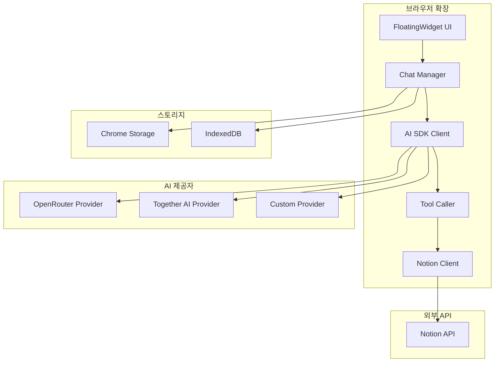
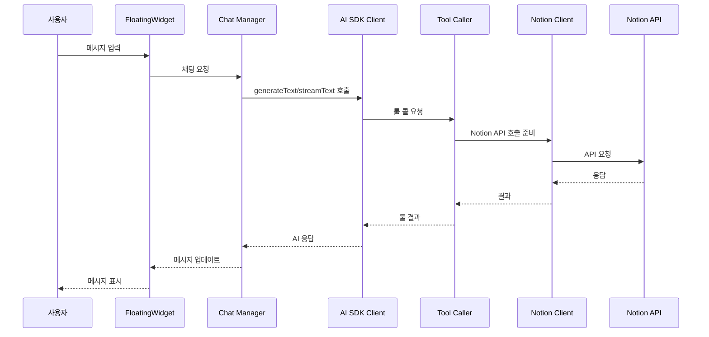

# 툴 콜링 시스템 기술 아키텍처

## 📋 개요

**문서 목적**: Annai 프로젝트의 툴 콜링 시스템 기술 아키텍처 설계
**핵심 목표**: 안정적이고 검증된 라이브러리를 사용하여 AI 모델과 Notion API 간의 통신 구현

---

## 🎯 핵심 요구사항

1. **다중 AI 모델 지원**: OpenRouter, Together AI 등 다양한 AI 모델 호환
2. **툴 콜링 표준화**: Vercel AI SDK를 사용하여 검증된 툴 콜링 구현
3. **Notion API 통합**: 안정적이고 효율적인 Notion API 호출
4. **스트리밍 지원**: 실시간 응답 제공
5. **확장성**: 새로운 툴 쉽게 추가
6. **에러 처리**: API 실패 시 적절한 재시도 및 사용자 피드백

---

## 🏗️ 기술 스택

### 핵심 라이브러리

| 라이브러리 | 버전 | 용도 | 선택 이유 |
|-----------|------|------|----------|
| `ai` | 최신 | 툴 콜링 프레임워크 | Vercel에서 개발, 검증된 툴 콜링 시스템, 다중 제공자 지원 |
| `@openrouter/ai-sdk-provider` | 최신 | OpenRouter 통합 | 공식 OpenRouter SDK, 수백 개의 AI 모델 접근 |
| `@ai-sdk/openai-compatible` | 최신 | OpenAI 호환 제공자 | Together AI 등 OpenAI 호환 API 지원 |
| `zod` | 최신 | 스키마 검증 | 타입스크립트와 완벽한 통합, 런타임 검증 |
| `solid-js` | 1.9.10 | UI 프레임워크 | 기존 프로젝트 사용 |

### 추가 라이브러리

| 라이브러리 | 용도 |
|-----------|------|
| `@notionhq/client` | Notion API 공식 클라이언트 |

---

## 📐 시스템 아키텍처

### 전체 구성도



### 툴 콜링 흐름



---

## 🔧 상세 구현

### 1. AI 제공자 설정

#### 1.1 OpenRouter 제공자

```typescript
// lib/ai/providers/openrouter.ts
import { createOpenRouter } from '@openrouter/ai-sdk-provider';

export const openrouter = createOpenRouter({
  apiKey: process.env.OPENROUTER_API_KEY || '', // 브라우저 스토리지에서 가져옴
});

export const openrouterModels = {
  'anthropic/claude-3.5-sonnet': 'Claude 3.5 Sonnet',
  'openai/gpt-4o': 'GPT-4o',
  'meta-llama/llama-3.1-70b-instruct': 'Llama 3.1 70B',
  'google/gemini-pro-1.5': 'Gemini Pro 1.5',
};
```

#### 1.2 Together AI 제공자

```typescript
// lib/ai/providers/together.ts
import { createOpenAICompatible } from '@ai-sdk/openai-compatible';

export const together = createOpenAICompatible({
  apiKey: process.env.TOGETHER_API_KEY || '', // 브라우저 스토리지에서 가져옴
  baseURL: 'https://api.together.xyz/v1',
});

export const togetherModels = {
  'meta-llama/Llama-3.3-70B-Instruct-Turbo': 'Llama 3.3 70B',
  'meta-llama/Llama-3.1-8B-Instruct-Turbo': 'Llama 3.1 8B',
  'mistralai/Mixtral-8x7B-Instruct-v0.1': 'Mixtral 8x7B',
};
```

#### 1.3 통합 제공자 매니저

```typescript
// lib/ai/providers/manager.ts
import { openrouter, openrouterModels } from './openrouter';
import { together, togetherModels } from './together';

export interface AIProvider {
  name: string;
  provider: any;
  models: Record<string, string>;
}

export const aiProviders: Record<string, AIProvider> = {
  openrouter: {
    name: 'OpenRouter',
    provider: openrouter,
    models: openrouterModels,
  },
  together: {
    name: 'Together AI',
    provider: together,
    models: togetherModels,
  },
};

export function getProvider(providerName: string) {
  return aiProviders[providerName]?.provider;
}

export function getAvailableModels(providerName: string) {
  return aiProviders[providerName]?.models || {};
}
```

---

### 2. Notion API 클라이언트

```typescript
// lib/notion/client.ts
import { Client } from '@notionhq/client';

export class NotionClient {
  private client: Client;

  constructor(apiKey: string) {
    this.client = new Client({
      auth: apiKey,
    });
  }

  // 페이지 생성
  async createPage(params: {
    parentId: string;
    title: string;
    content?: string;
  }) {
    return this.client.pages.create({
      parent: { page_id: params.parentId },
      properties: {
        title: {
          title: [
            {
              text: {
                content: params.title,
              },
            },
          ],
        },
      },
      children: params.content
        ? [
            {
              object: 'block',
              type: 'paragraph',
              paragraph: {
                rich_text: [
                  {
                    type: 'text',
                    text: { content: params.content },
                  },
                ],
              },
            },
          ]
        : undefined,
    });
  }

  // 페이지 읽기
  async getPage(pageId: string) {
    return this.client.pages.retrieve({ page_id: pageId });
  }

  // 페이지 수정
  async updatePage(pageId: string, params: { title?: string; archived?: boolean }) {
    return this.client.pages.update({
      page_id: pageId,
      properties: params.title
        ? {
            title: {
              title: [
                {
                  text: {
                    content: params.title,
                  },
                },
              ],
            },
          }
        : undefined,
      archived: params.archived,
    });
  }

  // 페이지 삭제 (아카이브)
  async deletePage(pageId: string) {
    return this.updatePage(pageId, { archived: true });
  }

  // 블록 추가
  async appendBlock(pageId: string, block: any) {
    return this.client.blocks.children.append({
      block_id: pageId,
      children: [block],
    });
  }

  // 블록 수정
  async updateBlock(blockId: string, block: any) {
    return this.client.blocks.update({
      block_id: blockId,
      ...block,
    });
  }

  // 블록 삭제
  async deleteBlock(blockId: string) {
    return this.client.blocks.delete({ block_id: blockId });
  }
}

// 싱글톤 인스턴스
let notionClientInstance: NotionClient | null = null;

export function getNotionClient(apiKey: string): NotionClient {
  if (!notionClientInstance || notionClientInstance['client']['auth'] !== apiKey) {
    notionClientInstance = new NotionClient(apiKey);
  }
  return notionClientInstance;
}
```

---

### 3. 툴 정의

```typescript
// lib/tools/notion-tools.ts
import { tool } from 'ai';
import { z } from 'zod';
import { getNotionClient } from '../notion/client';

export const notionTools = {
  createPage: tool({
    description: 'Create a new Notion page',
    inputSchema: z.object({
      parentId: z.string().describe('The parent page ID'),
      title: z.string().describe('The page title'),
      content: z.string().optional().describe('The page content'),
    }),
    execute: async ({ parentId, title, content }) => {
      const apiKey = await getNotionApiKey();
      const client = getNotionClient(apiKey);
      const result = await client.createPage({ parentId, title, content });
      return {
        success: true,
        pageId: result.id,
        url: result.url,
      };
    },
  }),

  getPage: tool({
    description: 'Get a Notion page by ID',
    inputSchema: z.object({
      pageId: z.string().describe('The page ID'),
    }),
    execute: async ({ pageId }) => {
      const apiKey = await getNotionApiKey();
      const client = getNotionClient(apiKey);
      const result = await client.getPage(pageId);
      return {
        success: true,
        page: result,
      };
    },
  }),

  updatePage: tool({
    description: 'Update a Notion page',
    inputSchema: z.object({
      pageId: z.string().describe('The page ID'),
      title: z.string().optional().describe('The new title'),
      archived: z.boolean().optional().describe('Archive the page'),
    }),
    execute: async ({ pageId, title, archived }) => {
      const apiKey = await getNotionApiKey();
      const client = getNotionClient(apiKey);
      const result = await client.updatePage(pageId, { title, archived });
      return {
        success: true,
        page: result,
      };
    },
  }),

  deletePage: tool({
    description: 'Delete (archive) a Notion page',
    inputSchema: z.object({
      pageId: z.string().describe('The page ID'),
    }),
    execute: async ({ pageId }) => {
      const apiKey = await getNotionApiKey();
      const client = getNotionClient(apiKey);
      await client.deletePage(pageId);
      return {
        success: true,
        message: `Page ${pageId} has been archived`,
      };
    },
  }),

  appendBlock: tool({
    description: 'Append a block to a Notion page',
    inputSchema: z.object({
      pageId: z.string().describe('The page ID'),
      blockType: z
        .enum([
          'paragraph',
          'heading_1',
          'heading_2',
          'heading_3',
          'bullet_list',
          'numbered_list',
          'to_do',
          'code',
          'quote',
        ])
        .describe('The block type'),
      content: z.string().describe('The block content'),
    }),
    execute: async ({ pageId, blockType, content }) => {
      const apiKey = await getNotionApiKey();
      const client = getNotionClient(apiKey);

      const block = createBlock(blockType, content);
      const result = await client.appendBlock(pageId, block);

      return {
        success: true,
        blockId: result.results[0].id,
      };
    },
  }),

  updateBlock: tool({
    description: 'Update a block in a Notion page',
    inputSchema: z.object({
      blockId: z.string().describe('The block ID'),
      blockType: z
        .enum([
          'paragraph',
          'heading_1',
          'heading_2',
          'heading_3',
          'bullet_list',
          'numbered_list',
      to_do',
          'code',
          'quote',
        ])
        .describe('The block type'),
      content: z.string().describe('The block content'),
    }),
    execute: async ({ blockId, blockType, content }) => {
      const apiKey = await getNotionApiKey();
      const client = getNotionClient(apiKey);

      const block = createBlock(blockType, content);
      const result = await client.updateBlock(blockId, block);

      return {
        success: true,
        block: result,
      };
    },
  }),

  deleteBlock: tool({
    description: 'Delete a block from a Notion page',
    inputSchema: z.object({
      blockId: z.string().describe('The block ID'),
    }),
    execute: async ({ blockId }) => {
      const apiKey = await getNotionApiKey();
      const client = getNotionClient(apiKey);
      await client.deleteBlock(blockId);
      return {
        success: true,
        message: `Block ${blockId} has been deleted`,
      };
    },
  }),
};

// 헬퍼 함수
function createBlock(type: string, content: string) {
  const baseBlock = {
    object: 'block' as const,
  };

  switch (type) {
    case 'paragraph':
      return {
        ...baseBlock,
        type: 'paragraph' as const,
        paragraph: {
          rich_text: [
            {
              type: 'text' as const,
              text: { content },
            },
          ],
        },
      };
    case 'heading_1':
      return {
        ...baseBlock,
        type: 'heading_1' as const,
        heading_1: {
          rich_text: [
            {
              type: 'text' as const,
              text: { content },
            },
          ],
        },
      };
    case 'heading_2':
      return {
        ...baseBlock,
        type: 'heading_2' as const,
        heading_2: {
          rich_text: [
            {
              type: 'text' as const,
              text: { content },
            },
          ],
        },
      };
    case 'heading_3':
      return {
        ...baseBlock,
        type: 'heading_3' as const,
        heading_3: {
          rich_text: [
            {
              type: 'text' as const,
              text: { content },
            },
          ],
        },
      };
    case 'bullet_list':
      return {
        ...baseBlock,
        type: 'bulleted_list_item' as const,
        bulleted_list_item: {
          rich_text: [
            {
              type: 'text' as const,
              text: { content },
            },
          ],
        },
      };
    case 'numbered_list':
      return {
        ...baseBlock,
        type: 'numbered_list_item' as const,
        numbered_list_item: {
          rich_text: [
            {
              type: 'text' as const,
              text: { content },
            },
          ],
        },
      };
    case 'to_do':
      return {
        ...baseBlock,
        type: 'to_do' as const,
        to_do: {
          rich_text: [
            {
              type: 'text' as const,
              text: { content },
            },
          ],
          checked: false,
        },
      };
    case 'code':
      return {
        ...baseBlock,
        type: 'code' as const,
        code: {
          rich_text: [
            {
              type: 'text' as const,
              text: { content },
            },
          ],
          language: 'plain_text',
        },
      };
    case 'quote':
      return {
        ...baseBlock,
        type: 'quote' as const,
        quote: {
          rich_text: [
            {
              type: 'text' as const,
              text: { content },
            },
          ],
        },
      };
    default:
      return createBlock('paragraph', content);
  }
}

// API 키 가져오기 (브라우저 스토리지)
async function getNotionApiKey(): Promise<string> {
  const result = await browser.storage.local.get('notionApiKey');
  return result.notionApiKey || '';
}
```

---

### 4. 채팅 매니저

```typescript
// lib/chat/manager.ts
import { generateText, streamText, type CoreMessage } from 'ai';
import { getProvider } from '../ai/providers/manager';
import { notionTools } from '../tools/notion-tools';
import { SYSTEM_PROMPT } from '../prompts/system-prompt';

export interface ChatOptions {
  provider: string;
  model: string;
  messages: CoreMessage[];
  stream?: boolean;
}

export interface ChatResult {
  text: string;
  toolCalls?: any[];
  toolResults?: any[];
}

export class ChatManager {
  async chat(options: ChatOptions): Promise<ChatResult> {
    const provider = getProvider(options.provider);
    if (!provider) {
      throw new Error(`Provider ${options.provider} not found`);
    }

    const model = provider(options.model);

    if (options.stream) {
      return this.streamChat(model, options.messages);
    } else {
      return this.generateChat(model, options.messages);
    }
  }

  private async generateChat(model: any, messages: CoreMessage[]): Promise<ChatResult> {
    const result = await generateText({
      model,
      messages,
      system: SYSTEM_PROMPT,
      tools: notionTools,
      maxSteps: 5, // 최대 5단계 툴 콜
    });

    return {
      text: result.text,
      toolCalls: result.toolCalls,
      toolResults: result.toolResults,
    };
  }

  private async streamChat(model: any, messages: CoreMessage[]): Promise<ChatResult> {
    const result = streamText({
      model,
      messages,
      system: SYSTEM_PROMPT,
      tools: notionTools,
      maxSteps: 5,
    });

    // 스트리밍 처리
    let fullText = '';
    const toolCalls: any[] = [];
    const toolResults: any[] = [];

    for await (const delta of result.textStream) {
      fullText += delta;
      // UI 업데이트
      this.onTextDelta(delta);
    }

    for await (const step of result.stepStream) {
      if (step.toolCalls) {
        toolCalls.push(...step.toolCalls);
        this.onToolCalls(step.toolCalls);
      }
      if (step.toolResults) {
        toolResults.push(...step.toolResults);
        this.onToolResults(step.toolResults);
      }
    }

    return {
      text: fullText,
      toolCalls,
      toolResults,
    };
  }

  // 이벤트 핸들러 (UI에서 오버라이드)
  protected onTextDelta(delta: string): void {}
  protected onToolCalls(calls: any[]): void {}
  protected onToolResults(results: any[]): void {}
}
```

---

### 5. 시스템 프롬프트

```typescript
// lib/prompts/system-prompt.ts
export const SYSTEM_PROMPT = `
You are Annai, an AI assistant for Notion workspace.

Your capabilities:
- Create, read, update, and delete Notion pages
- Add, modify, and delete blocks in pages
- Help users organize and manage their Notion workspace

Guidelines:
- Always explain what you're doing before taking action
- Ask for clarification if the request is ambiguous
- Provide clear and concise responses
- Use the available tools to interact with Notion

Available tools:
- createPage: Create a new page
- getPage: Get page details
- updatePage: Update page title or archive
- deletePage: Archive a page
- appendBlock: Add content to a page
- updateBlock: Modify existing content
- deleteBlock: Remove content from a page

Remember: You can only perform actions that are explicitly requested by the user.
`;
```

---

### 6. 설정 스토어

```typescript
// lib/store/settings.ts
import { createSignal } from 'solid-js';

export interface AISettings {
  provider: string;
  model: string;
  apiKey: string;
}

export interface NotionSettings {
  apiKey: string;
}

export interface Settings {
  ai: AISettings;
  notion: NotionSettings;
}

const [settings, setSettings] = createSignal<Settings>({
  ai: {
    provider: 'openrouter',
    model: 'anthropic/claude-3.5-sonnet',
    apiKey: '',
  },
  notion: {
    apiKey: '',
  },
});

export function useSettings() {
  return {
    settings,
    setSettings,
    async loadSettings() {
      const result = await browser.storage.local.get(['settings']);
      if (result.settings) {
        setSettings(result.settings);
      }
    },
    async saveSettings(newSettings: Settings) {
      setSettings(newSettings);
      await browser.storage.local.set({ settings: newSettings });
    },
  };
}
```

---

## 📦 파일 구조

```
Annai/
├── lib/
│   ├── ai/
│   │   ├── providers/
│   │   │   ├── openrouter.ts      # OpenRouter 제공자
│   │   │   ├── together.ts         # Together AI 제공자
│   │   │   └── manager.ts         # 제공자 매니저
│   │   └── client.ts              # AI 클라이언트
│   ├── notion/
│   │   └── client.ts              # Notion API 클라이언트
│   ├── tools/
│   │   └── notion-tools.ts       # Notion 툴 정의
│   ├── prompts/
│   │   └── system-prompt.ts      # 시스템 프롬프트
│   ├── store/
│   │   └── settings.ts           # 설정 스토어
│   └── chat/
│       └── manager.ts            # 채팅 매니저
├── components/
│   ├── Chat/
│   │   ├── MessageList.tsx        # 메시지 리스트
│   │   ├── ToolCallDisplay.tsx    # 툴 콜 표시
│   │   └── LoadingIndicator.tsx   # 로딩 표시
│   └── Settings/
│       ├── SettingsPanel.tsx      # 설정 패널
│       ├── AIModelSelector.tsx    # AI 모델 선택
│       └── NotionAuth.tsx        # Notion 인증
└── entrypoints/
    ├── popup/
    │   └── Settings.tsx           # 팝업 설정 페이지
    └── content/
        └── index.tsx             # 콘텐츠 스크립트
```

---

## 🔐 보안 고려사항

### API 키 관리
- API 키는 브라우저 로컬 스토리지에 저장
- 절대 로그에 기록하지 않음 (리팩토링 완료)
- 필요한 경우 암호화 고려

### Notion API
- Notion API 토큰은 사용자가 직접 입력
- 토큰 만료 및 갱신 처리
- 권한 범위 최소화

### AI API
- OpenRouter/Together AI API 키는 사용자가 직접 입력
- 사용량 모니터링
- 비용 제한 기능 고려

---

## 🚀 구현 단계

### Phase 1: 기본 설정 (1일)
- [ ] Vercel AI SDK 설치
- [ ] OpenRouter 제공자 구현
- [ ] Together AI 제공자 구현
- [ ] 제공자 매니저 구현

### Phase 2: Notion API 통합 (2일)
- [ ] Notion 클라이언트 구현
- [ ] 툴 정의 및 구현
- [ ] 툴 테스트

### Phase 3: 채팅 시스템 (2일)
- [ ] 채팅 매니저 구현
- [ ] 스트리밍 지원
- [ ] UI 통합

### Phase 4: 설정 및 인증 (1일)
- [ ] 설정 스토어 구현
- [ ] 설정 UI 구현
- [ ] 인증 흐름 구현

### Phase 5: 테스트 및 디버깅 (1일)
- [ ] 유닛 테스트
- [ ] 통합 테스트
- [ ] 에러 처리 개선

---

## 📊 성능 최적화

### 캐싱
- Notion 페이지 응답 캐싱
- AI 모델 응답 캐싱 (선택적)

### 병렬 처리
- 독립적인 툴 콜 병렬 실행
- Vercel AI SDK 자동 병렬화 활용

### 재시도 로직
- API 실패 시 지수 백오프 재시도
- 최대 재시도 횟수 설정

---

## 🧪 테스트 전략

### 유닛 테스트
- 툴 실행 로직
- Notion 클라이언트
- 채팅 매니저

### 통합 테스트
- 전체 툴 콜링 흐름
- 에러 처리
- 스트리밍

### E2E 테스트
- 사용자 시나리오
- 크로스 브라우저

---

## 📈 모니터링

### 로깅
- 툴 콜 로그 (민감 정보 제외)
- API 응답 시간
- 에러 로그

### 메트릭
- 툴 콜 성공률
- 평균 응답 시간
- 사용자 만족도

---

*문서 생성일: 2026-01-18*
*마지막 수정일: 2026-01-18*
